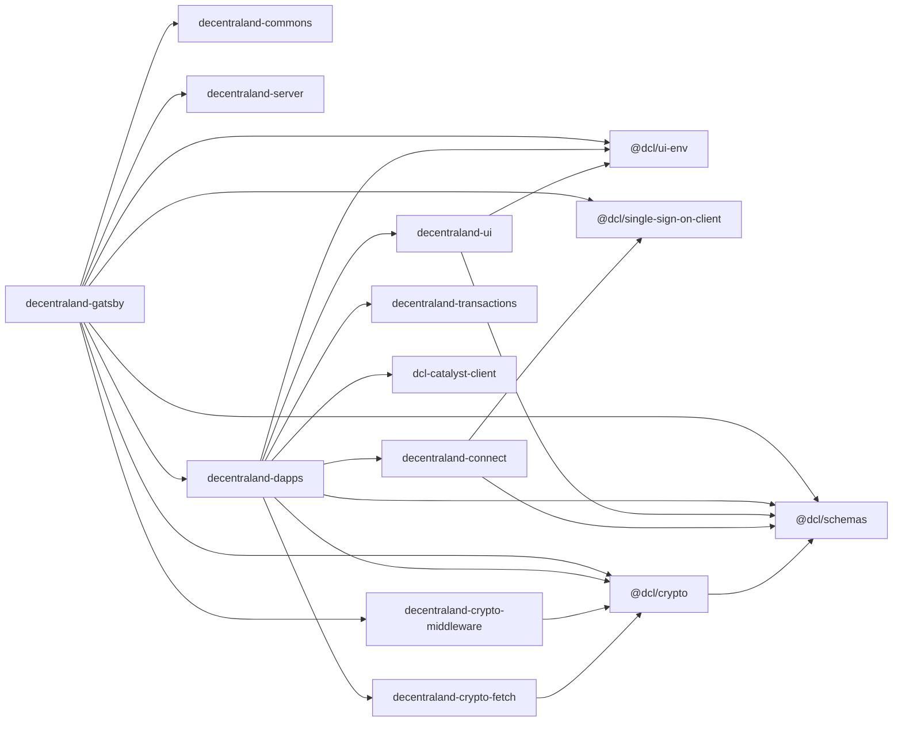

# Deps decentraland-gatsby<>decentraland-dapps

```mermaid
graph LR

dgatsby["decentraland-gatsby"] --> dcommons["decentraland-commons"]
dgatsby --> dcryptomidw["decentraland-crypto-middleware"]
dgatsby --> dserver["decentraland-server"]
dgatsby --> duienv["@dcl/ui-env"]
dgatsby --> dsso["@dcl/single-sign-on-client"]
dgatsby --> dschemas["@dcl/schemas"]
dgatsby --> dcrypto["@dcl/crypto"]
dgatsby --> ddapps["decentraland-dapps"]
ddapps --> ui["decentraland-ui"]
ddapps --> dconnect["decentraland-connect"]
ddapps --> dcryptofetch["decentraland-crypto-fetch"]
ddapps --> dtx["decentraland-transactions"]
ddapps --> dcclient["dcl-catalyst-client"]
ddapps --> dcrypto
ddapps --> duienv
ddapps --> dschemas
ui --> dschemas
ui --> duienv
dconnect --> dschemas
dconnect --> dsso
dcrypto --> dschemas
dcryptomidw --> dcrypto
dcryptofetch --> dcrypto

click dgatsby href "https://github.com/decentraland/decentraland-gatsby" _blank
%% decentraland-commons could be removed, not used, no update since 4 years ago
click dcommons href "https://github.com/decentraland/decentraland-commons" _blank
click dcryptomidw href "https://github.com/decentraland/decentraland-crypto-middleware" _blank
click dserver href "https://github.com/decentraland/decentraland-server" _blank
click duienv href "https://github.com/decentraland/ui-env" _blank
click dsso href "https://github.com/decentraland/single-sign-on-client" _blank
click dschemas href "https://github.com/decentraland/schemas" _blank
click dcrypto href "https://github.com/decentraland/decentraland-crypto" _blank
click ddapps href "https://github.com/decentraland/decentraland-dapps" _blank
click ui href "https://github.com/decentraland/ui" _blank
click dconnect href "https://github.com/decentraland/decentraland-connect" _blank
click dcryptofetch href "https://github.com/decentraland/decentraland-crypto-fetch" _blank
click dtx href "https://github.com/decentraland/decentraland-transactions" _blank
click dcclient href "https://github.com/decentraland/catalyst-client" _blank

```